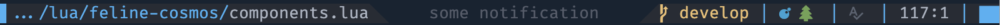

# feline-cosmos 




This plugin is an extension for the [feline.nvim](https://github.com/feline-nvim/feline.nvim). 
It follows the idea of reusing providers and makes it possible to reuse other main properties 
of components, such as highlighting or icons. Moreover, with `feline-cosmos` you can reuse 
the whole component or whole statusline!

For example, assume you have a lua script, where all your components are described:

```lua
-- my_components.lua

return {
  progress = {
    provider = 'scroll_bar', -- default provider from the feline
    hl = 'vi_mode' -- highlight according to the current vi mode
  },

  file = {
    provider = 'file_info', -- default provider from the feline
    hl = 'file_status' -- highlight depends on the current state of the file (readonly, modified or nothing)
  }
}
```

Now, you can describe your status line just referring to appropriate components in the same way 
as the original `feline` plugin:

```lua
-- my_statusline.lua

return {
  active = {
    { component = 'progress' },
    { component = 'file' }
  },
  inactive = {
    -- in an inactive window we want always to show a file_info in grey
    { component = 'file', hl = { fg = 'grey' } }
  }
}
```

And finally, set up your status line:

```lua
require('feline-cosmos').setup {
  components = require('my_statusline'),
  custom_components = require('my_components')
}
```

More details you can find here: [Guide.md](Guide.md).

## How to install

With [packer.nvim](https://github.com/wbthomason/packer.nvim/):

```lua
use({
    'dokwork/feline-cosmos',
    requires = {
        'kyazdani42/nvim-web-devicons',
        'famiu/feline.nvim',
        'tpope/vim-fugitive', -- used for git components
    },
    -- optionally, you can setup preconfigured statusline:
    config = function()
        require('feline-cosmos.cosmosline').setup()
    end,
})
```

## Motivation

I'm glad to use the [feline.nvim](https://github.com/feline-nvim/feline.nvim) plugin. This is a very
powerful and useful plugin for configuring the neovim status line. But for my taste, the final
configuration usually looks a little bit cumbersome and messy. I prefer to separate an
implementation of the components and their composition. Also, I think that not only providers deserve
being reusable, but icons and highlights too. 

For example, `feline` has the provider of the git branch. That provider can also return an icon
depending on the state of the current git working directory. But how about highlighting, which can
depend on the git state too? Unfortunately, you have to specified it additionally and can't inherit
it. So, my idea is being able to share between users reusable libraries of the components or their
properties, such as providers, icons, or highlights, and apply the most interesting or helpful of
them to your own configuration. Or share a complete status line configuration with customization,
instead of copy-past it from the different sources.

Of course, resolving providers, icons, highlights, or whole components has a performance penalty.
But first, the penalty is not significant, and second, I'm ready to sacrifice a little performance
for the sake of clarity. Finally, this project is more the proof of concept, instead of the final
solution, and currently **is under develop**.


## TODO

 - Add more documentation

